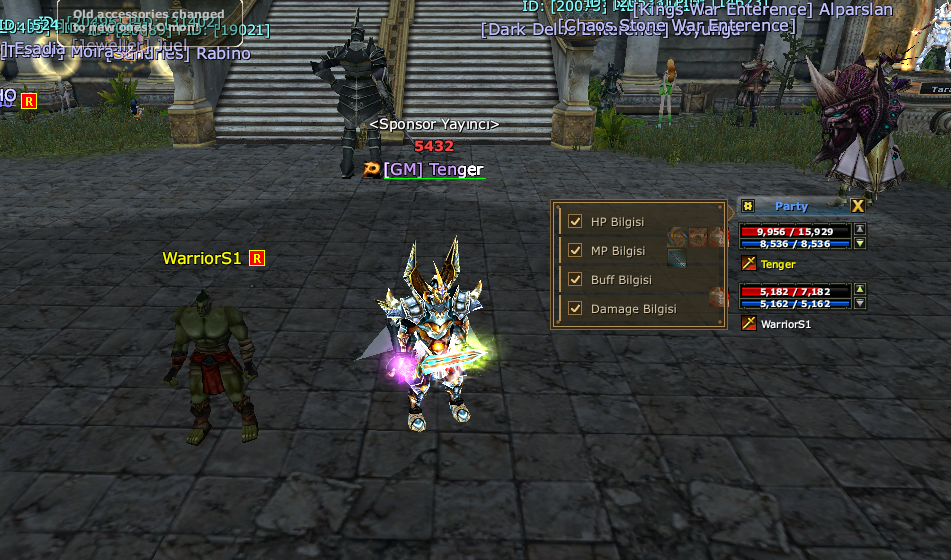

# 🔥 SEXYKO PARTY SİSTEMİ YENİLENDİ!

- Forum: https://forum.sexyko.com/d/11
- Etiket: Oyun Rehberi, SexyKO Oyun Rehberi
- Açılış: 2026-08-31 · yazar Tenger · mesaj 1 · görüntülenme ?
- Arşiv: 8 Eki 2026 (Flarum API) · resim 2/2

## Mesaj 1 — Tenger — 2026-08-31 11:54 (düzenleme 2026-09-03)

👥 PARTY ÜYELERİNİ ARTIK DAHA DETAYLI TAKİP EDİN!

SexyKO'da party sistemi daha kullanışlı ve kontrol edilebilir hale getirildi.

Party içerisindeki oyuncuların hangi bilgilerini görmek istediğinizi artık **siz seçebilirsiniz.**

━━━━━━━━━━━━━━━━━━━━━━━━━━━━

⚙️ PARTY SETTINGS

Party panelinde bulunan ayarlar üzerinden;

❤️ HP BİLGİSİ

💙 MP BİLGİSİ

✨ BUFF BİLGİSİ

⚔️ DAMAGE BİLGİSİ

seçeneklerini ayrı ayrı açıp kapatabilirsiniz.

━━━━━━━━━━━━━━━━━━━━━━━━━━━━

❤️ HP BİLGİSİ

Party üyelerinizin mevcut HP durumunu anlık olarak takip edebilirsiniz.

💙 MP BİLGİSİ

Party üyelerinin MP durumunu görebilir, özellikle mage ve destek sınıflarında kontrolü kolaylaştırabilirsiniz.

✨ BUFF BİLGİSİ

Party üyelerinizin buff durumlarını takip edebilirsiniz.

⚔️ DAMAGE BİLGİSİ

Party üyelerinin verdiği damage bilgisini party ekranı üzerinden takip edebilirsiniz.

━━━━━━━━━━━━━━━━━━━━━━━━━━━━

🎯 KISACA:

Party ekranınızı tamamen **kendi oyun tarzınıza göre düzenleyin.**

✅ HP'yi görmek istiyorsan → AÇ

✅ MP'yi görmek istiyorsan → AÇ

✅ Buff takibi istiyorsan → AÇ

✅ Damage görmek istiyorsan → AÇ

İstemediğiniz bilgileri ise tek tıkla kapatabilirsiniz.

━━━━━━━━━━━━━━━━━━━━━━━━━━━━

🔥 DAHA FAZLA BİLGİ

🎯 DAHA FAZLA KONTROL

⚡ DAHA PRATİK PARTY YÖNETİMİ

SEXYKO'DA PARTY OYNAMAK ARTIK DAHA KOLAY!
