# ⚙️ SEXYKO F10 OYUN AYARLARI

- Forum: https://forum.sexyko.com/d/12
- Etiket: Oyun Rehberi, SexyKO Oyun Rehberi
- Açılış: 2026-08-31 · yazar Tenger · mesaj 1 · görüntülenme ?
- Arşiv: 8 Eki 2026 (Flarum API) · resim 11/11

## Mesaj 1 — Tenger — 2026-08-31 12:06 (düzenleme 2026-09-03)

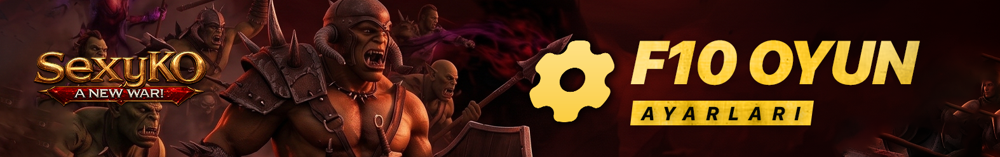

**⚙️ SEXYKO F10 OYUN AYARLARI**

**🎮 OYUN DENEYİMİNİZİ KENDİNİZE GÖRE ÖZELLEŞTİRİN!**

Yeni SexyKO Client ile birlikte oyun içerisindeki birçok detayı artık **F10 Oyun Ayarları** üzerinden tamamen kendi tercihinize göre düzenleyebilirsiniz.

Kamera hassasiyetinden FPS limitine, grafiklerden skill efektlerine, loot filtrelerinden bildirimlere ve yazı boyutlarına kadar birçok seçenek tek bir merkezde toplandı.

**Oyundayken F10 tuşuna basarak Oyun Ayarları menüsüne ulaşabilirsiniz.**

**🎮 01 — OYUN AYARLARI**

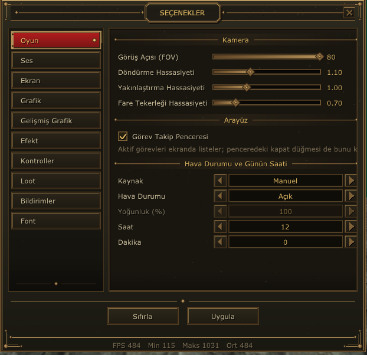

Oyunun temel kullanımını, kamera davranışlarını ve çevresel görünümü bu bölümden kişiselleştirebilirsiniz.

**📷 KAMERA**

• **Görüş Açısı (FOV):** Kameranın görüş alanını belirler.

• **Döndürme Hassasiyeti:** Kamerayı sağa ve sola çevirirken oluşan hassasiyeti ayarlar.

• **Yakınlaştırma Hassasiyeti:** Kamera yakınlaştırma ve uzaklaştırma hızını belirler.

• **Fare Tekerleği Hassasiyeti:** Mouse tekerleği ile yapılan zoom hareketinin hassasiyetini ayarlar.

**🖥️ ARAYÜZ**

• **Görev Takip Penceresi:** Aktif görevlerinizi oyun ekranında takip etmenizi sağlar.

**🌦️ HAVA DURUMU & GÜNÜN SAATİ**

• Hava durumu efektlerini aktif veya pasif hale getirebilirsiniz.

• **Yoğunluk (%)** seçeneğiyle hava efektlerinin yoğunluğunu ayarlayabilirsiniz.

• **Saat / Dakika** seçenekleriyle oyun içerisindeki zaman görünümünü düzenleyebilirsiniz.

[HR]

**🔊 02 — SES AYARLARI**

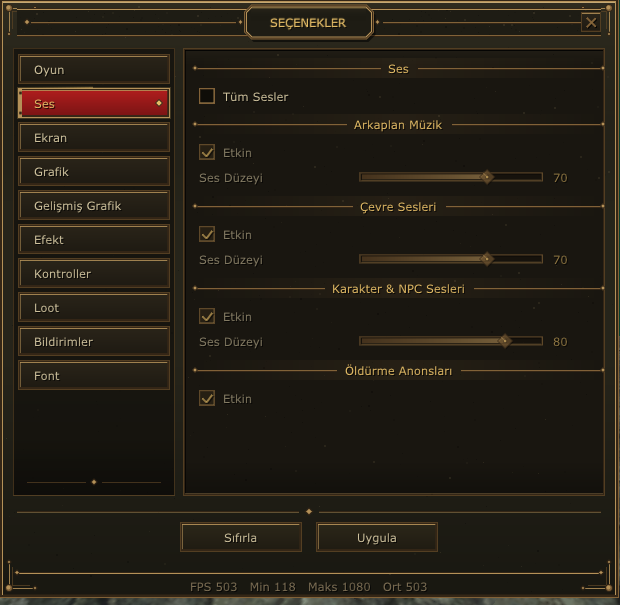

Oyundaki farklı ses kaynaklarını birbirinden bağımsız olarak kontrol edebilirsiniz.

**🎵 ARKAPLAN MÜZİĞİ**

Oyun müziğini açıp kapatabilir ve ses seviyesini ayrı olarak ayarlayabilirsiniz.

**🌍 ÇEVRE SESLERİ**

Harita ve çevrede bulunan seslerin seviyesini kontrol edebilirsiniz.

**👤 KARAKTER & NPC SESLERİ**

Karakterlerden ve NPC'lerden gelen sesleri ayrı şekilde düzenleyebilirsiniz.

**☠️ ÖLDÜRME ANONSLARI**

Öldürme anonslarının sesini aktif veya pasif hale getirebilirsiniz.

**🔇 TÜM SESLER**

İsterseniz oyun içerisindeki sesleri tek seferde kapatabilirsiniz.

[HR]

**🖥️ 03 — EKRAN AYARLARI**

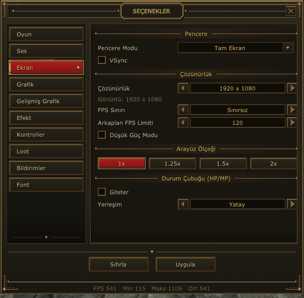

Oyunun görüntüleme şeklini, çözünürlüğünü, FPS değerlerini ve arayüz ölçeğini bu bölümden kontrol edebilirsiniz.

**🪟 PENCERE & VSYNC**

• Pencere görüntüleme seçeneklerini değiştirebilirsiniz.

• **VSync** özelliğini aktif veya pasif hale getirebilirsiniz.

**📐 ÇÖZÜNÜRLÜK**

Oyunu monitörünüze uygun çözünürlükte çalıştırabilirsiniz.

**🎯 FPS AYARLARI**

• **FPS Sınırı:** Maksimum FPS değerini belirler.

• **Arkaplan FPS Limiti:** Oyun arka plandayken kullanılacak FPS değerini belirler.

• **Düşük Güç Modu:** Gereksiz sistem kaynak kullanımını azaltmaya yardımcı olur.

**🔍 ARAYÜZ ÖLÇEĞİ**

Arayüz boyutunu farklı ölçeklerde kullanabilirsiniz.

**❤️ DURUM ÇUBUĞU**

HP/MP durum çubuğunun görünürlüğünü ve yerleşimini düzenleyebilirsiniz.

**🎨 04 — GRAFİK AYARLARI**

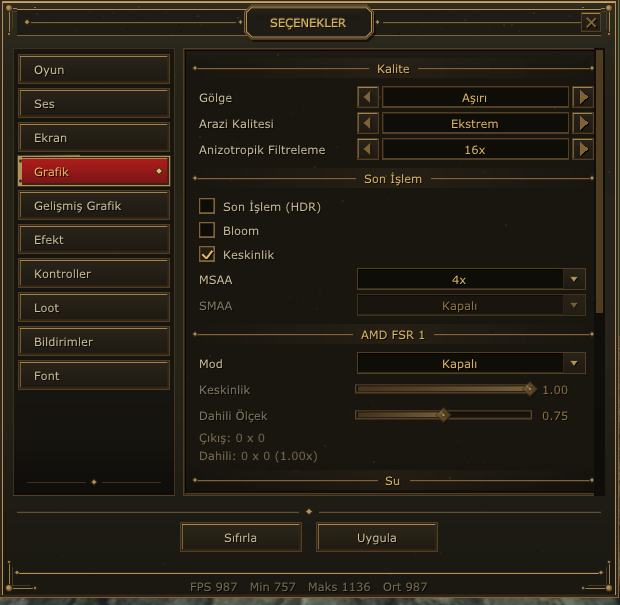

Grafik ayarları sayesinde görüntü kalitesi ile performans arasındaki dengeyi kendi sisteminize göre oluşturabilirsiniz.

**🌑 KALİTE**

• **Gölge:** Gölge kalitesini belirler.

• **Arazi Kalitesi:** Harita ve arazi detaylarının kalitesini ayarlar.

• **Anizotropik Filtreleme:** Uzak yüzeylerde görüntü netliğini artırır.

**✨ SON İŞLEM**

• HDR

• Bloom

• Keskinlik

gibi görüntü efektlerini kontrol edebilirsiniz.

**🧩 KENAR YUMUŞATMA**

• MSAA

• SMAA

seçenekleriyle görüntüdeki kenarların daha düzgün görünmesini sağlayabilirsiniz.

**🚀 AMD FSR 1**

Destekleyen sistemlerde performans odaklı görüntü ölçekleme kullanılabilir.

**Mod, Keskinlik ve Dahili Ölçek** seçenekleriyle görüntü kalitesi ve performans arasında istediğiniz dengeyi oluşturabilirsiniz.

[HR]

**🌈 05 — GELİŞMİŞ GRAFİK AYARLARI**

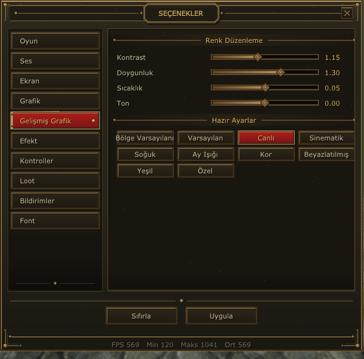

Oyunun genel renk atmosferini kendi zevkinize göre değiştirebileceğiniz bölüm.

**🎨 RENK DÜZENLEME**

• **Kontrast:** Açık ve koyu alanlar arasındaki farkı ayarlar.

• **Doygunluk:** Renklerin canlılığını belirler.

• **Sıcaklık:** Görüntüyü sıcak veya soğuk tonlara taşır.

• **Ton:** Genel renk tonlamasını değiştirir.

**🖌️ HAZIR RENK PROFİLLERİ**

• Bölge Varsayılanı

• Varsayılan

• Canlı

• Sinematik

• Soğuk

• Ay Işığı

• Kor

• Beyazlatılmış

• Yeşil

• Özel

Tek tek ayar yapmak istemeyen oyuncular hazır profillerden birini seçerek görüntüyü hızlıca değiştirebilir.

[HR]

**💥 06 — EFEKT AYARLARI**

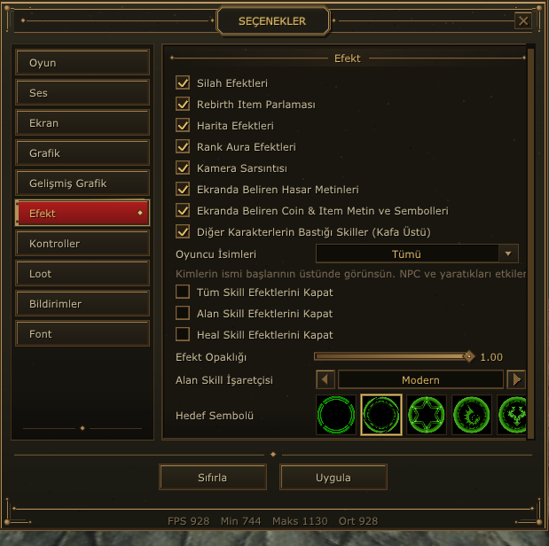

Özellikle kalabalık savaşlarda ve farm alanlarında ekrandaki görsel karmaşayı azaltmak için detaylı efekt seçenekleri sunuluyor.

**✨ EFEKT KONTROLLERİ**

• Silah Efektleri

• Rebirth Item Parlaması

• Harita Efektleri

• Rank Aura Efektleri

• Kamera Sarsıntısı

• Ekranda Beliren Hasar Metinleri

• Coin & Item Metin ve Sembolleri

• Diğer Karakterlerin Skill Efektleri

**👤 OYUNCU İSİMLERİ**

Oyuncu isimlerinin görünürlüğünü kontrol edebilirsiniz.

**⚔️ SKILL EFEKTLERİ**

• Tüm Skill Efektlerini Kapat

• Alan Skill Efektlerini Kapat

• Heal Skill Efektlerini Kapat

**🎚️ EFEKT OPAKLILIĞI**

Efektlerin ekrandaki görünürlük seviyesini ayarlayabilirsiniz.

**🎯 ALAN SKILL İŞARETÇİSİ**

Alan skillerinde kullanılacak işaretçi görünümünü değiştirebilirsiniz.

**🔵 HEDEF SEMBOLÜ**

Hedef göstergesi için farklı semboller arasından seçim yapabilirsiniz.

**💡 Özellikle CZ ve kalabalık savaşlarda gereksiz efektleri kapatarak daha temiz ve anlaşılır bir görüntü elde edebilirsiniz.**

[HR]

**🎮 07 — KONTROL AYARLARI**

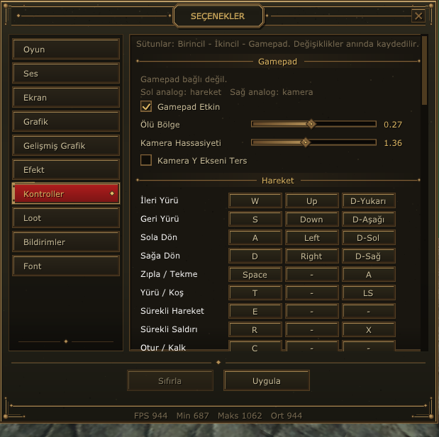

Klavye, mouse ve gamepad kullanımını kendi oyun tarzınıza göre düzenleyebilirsiniz.

**🎮 GAMEPAD**

• Gamepad Etkin

• Ölü Bölge

• Kamera Hassasiyeti

• Kamera Y Ekseni Ters

**⌨️ HAREKET & KONTROL TUŞLARI**

Oyundaki hareket ve çeşitli işlemler için kullanılan tuşları kişiselleştirebilirsiniz.

• İleri Yürü

• Geri Yürü

• Sola Dön

• Sağa Dön

• Zıpla / Tekme

• Yürü / Koş

• Sürekli Hareket

• Sürekli Saldırı

• Otur / Kalk

**⚡ Tuş değişiklikleri anında kaydedilir.**

[HR]

**🎒 08 — LOOT AYARLARI**

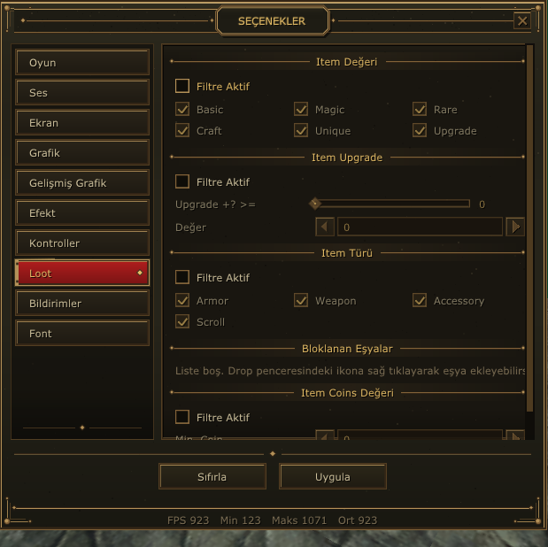

Farm yapan oyuncular için en kullanışlı özelliklerden biri olan Loot sistemi sayesinde yerdeki eşyaları farklı kriterlere göre filtreleyebilirsiniz.

**💎 ITEM DEĞERİ**

• Magic

• Rare

• Craft

• Unique

• Upgrade

kategorilerine göre filtreleme yapılabilir.

**⬆️ ITEM UPGRADE**

**Upgrade +? >=** seçeneği ile belirlediğiniz upgrade seviyesinden itibaren filtreleme yapabilirsiniz.

**🛡️ ITEM TÜRÜ**

• Armor

• Weapon

• Accessory

• Scroll

**🚫 BLOKLANAN EŞYALAR**

İstemediğiniz itemleri filtreye ekleyebilirsiniz.

**📌 Drop penceresindeki item ikonuna sağ tıklayarak eşya ekleyebilirsiniz.**

**🪙 ITEM COINS DEĞERİ**

Itemlerin coin değerine göre filtreleme yapabilirsiniz.

**🎯 AMAÇ**

Gereksiz dropları azaltmak, değerli eşyaları daha kolay ayırt etmek ve farm sırasında loot yönetimini kolaylaştırmak.

[HR]

**🔔 09 — BİLDİRİM AYARLARI**

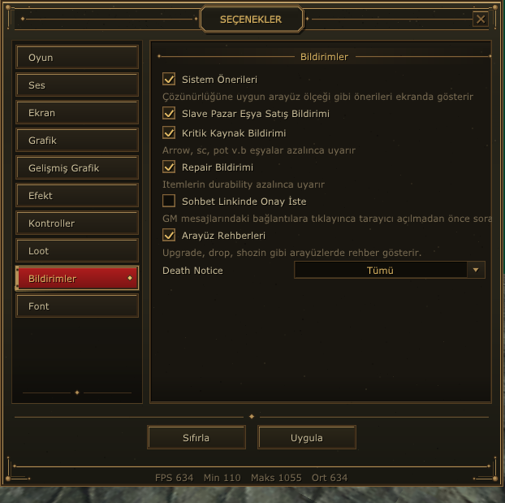

Oyun içerisinde hangi bildirimleri almak istediğinizi bu bölümden belirleyebilirsiniz.

**💡 SİSTEM ÖNERİLERİ**

Sistem tarafından sunulan öneri ve uyarıları kontrol eder.

**🛒 SLAVE PAZAR EŞYA SATIŞ BİLDİRİMİ**

Slave pazarınızda bulunan eşyaların satışı hakkında bildirim almanızı sağlar.

**⚠️ KRİTİK KAYNAK BİLDİRİMİ**

Arrow, SC, pot gibi kritik kaynaklar azaldığında sizi uyarır.

**🔧 REPAIR BİLDİRİMİ**

Itemlerinizin dayanıklılığı azaldığında tamir etmeniz gerektiğini bildirir.

**🔗 SOHBET LİNKİNDE ÖNCE İSTE**

Sohbet içerisindeki bağlantılara tıklarken ek bir onay mekanizması sağlar.

**📖 ARAYÜZ REHBERLERİ**

Upgrade, drop, shozin gibi çeşitli arayüzlerde rehber bilgilerinin gösterilmesini sağlar.

**☠️ DEATH NOTICE**

Ölüm bildirimleriyle ilgili gösterim seçeneklerini kontrol eder.

[HR]

**🔤 10 — FONT / YAZI AYARLARI**

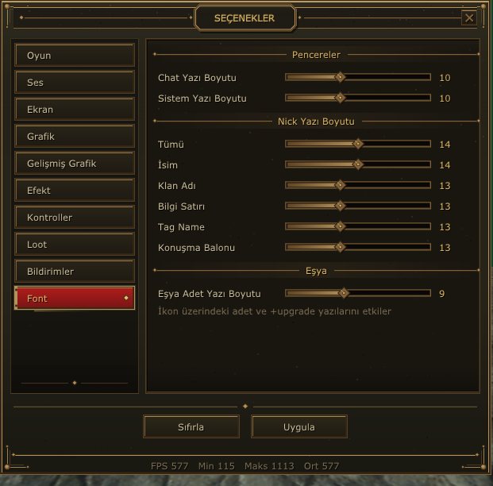

Oyun içerisindeki yazıların boyutlarını kendi ekranınıza ve kullanımınıza göre ayarlayabilirsiniz.

**💬 PENCERE YAZILARI**

• Chat Yazı Boyutu

• Sistem Yazı Boyutu

**👤 NICK YAZILARI**

• Tümü

• İsim

• Klan Adı

• Bilgi Satırı

• Tag Name

• Konuşma Balonu

**🎒 EŞYA YAZILARI**

**Eşya Adet Yazı Boyutu** ile itemler üzerindeki adet ve ilgili yazıların boyutunu değiştirebilirsiniz.

Özellikle yüksek çözünürlüklü monitörlerde küçük yazıları okumakta zorlanan oyuncular için oldukça kullanışlı bir özellik.

**⚙️ TEK MENÜDE TAM KONTROL!**

**🎮 Oyun** • **🔊 Ses** • **🖥️ Ekran** • **🎨 Grafik** • **🌈 Gelişmiş Grafik**

**💥 Efekt** • **🎮 Kontrol** • **🎒 Loot** • **🔔 Bildirim** • **🔤 Font**

SexyKO'nun yeni F10 sistemiyle oyun deneyiminizi artık kendi tercihinize göre şekillendirebilirsiniz.

**İster maksimum FPS için performans odaklı oynayın,

ister tüm grafik ve efektleri açarak görsel kaliteyi sonuna kadar kullanın.**

**🔥 SEXYKO**

**OYUNU SADECE OYNAMA, KENDİNE GÖRE AYARLA!**
