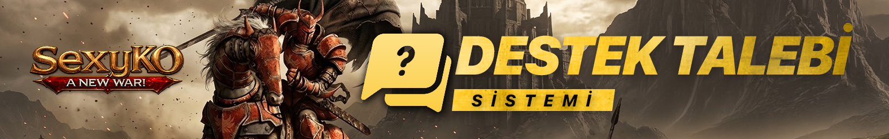
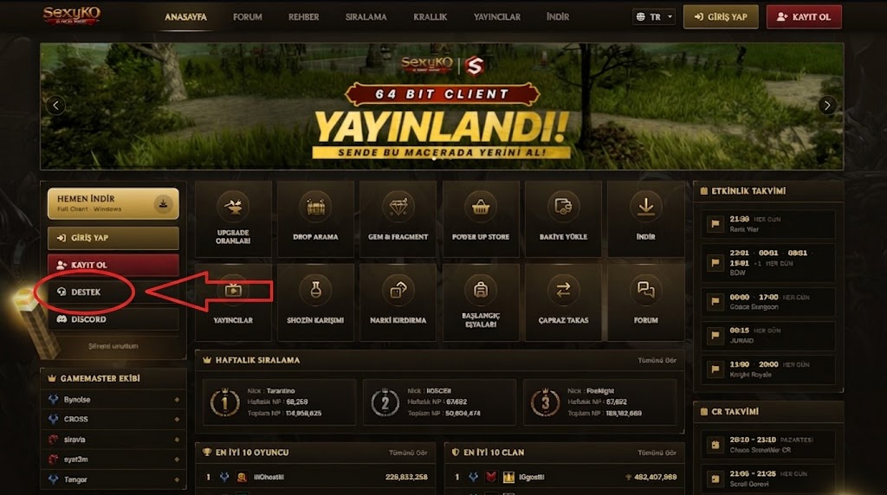
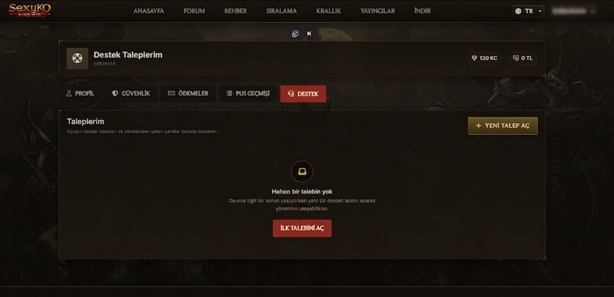
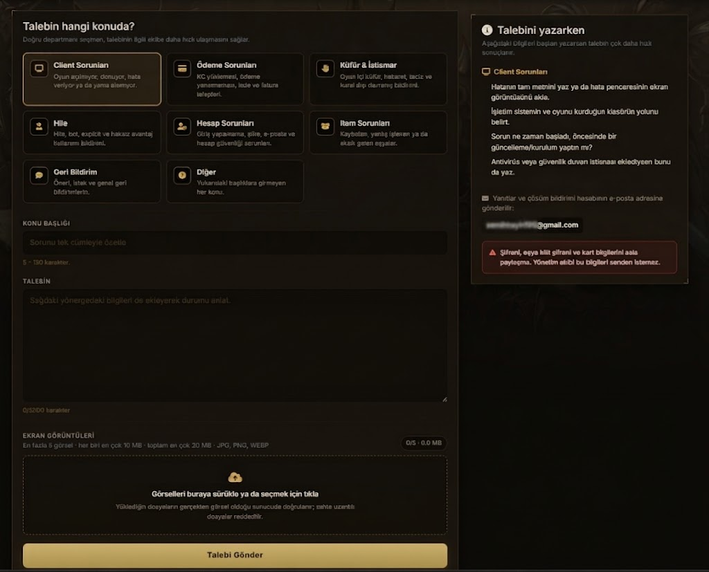

# 🎫 SEXYKO DESTEK TALEBİ SİSTEMİ

- Forum: https://forum.sexyko.com/d/13
- Etiket: Oyun Rehberi, SexyKO Oyun Rehberi
- Açılış: 2026-08-31 · yazar Tenger · mesaj 1 · görüntülenme ?
- Arşiv: 8 Eki 2026 (Flarum API) · resim 4/4

## Mesaj 1 — Tenger — 2026-08-31 17:59 (düzenleme 2026-09-03)

# 🎫 SEXYKO DESTEK TALEBİ SİSTEMİ

**Sorununuzu doğru kategori üzerinden hızlı ve kolay şekilde yönetim ekibine iletin.**

SexyKO web sitesinde bulunan **Destek Talebi Sistemi** sayesinde oyun, hesap, ödeme, teknik sorunlar veya diğer konularla ilgili taleplerinizi doğrudan yönetim ekibine gönderebilirsiniz.

Destek sistemini kullanmak için hesabınıza giriş yapmanız yeterlidir.

---

## 🟢 01 — DESTEK BÖLÜMÜNE GİRİŞ

SexyKO hesabınıza giriş yaptıktan sonra web sitesinin **sol tarafında bulunan DESTEK** butonuna tıklayın.

Bu bölüm üzerinden:

- yeni destek talebi oluşturabilir,

- daha önce açtığınız ticketları görüntüleyebilir,

- yönetim tarafından verilen cevapları takip edebilirsiniz.

**Hesabına giriş yap → DESTEK butonuna tıkla**

---

# 🎫 02 — YENİ DESTEK TALEBİ OLUŞTURMA

Destek bölümüne girdiğinizde **Destek Taleplerim** ekranı açılır.

Yeni bir ticket oluşturmak için:

**➕ YENİ TALEP AÇ**

butonuna tıklamanız yeterlidir.

Daha önce oluşturduğunuz destek talepleri de bu ekran üzerinde listelenir.

---

# 📝 03 — SORUNUNUZU BİLDİRİN

Yeni destek talebi oluşturma ekranında öncelikle yaşadığınız probleme uygun kategoriyi seçin.

Ardından aşağıdaki alanları doldurun:

## 📌 Konu Başlığı

Sorununuzu kısa ve anlaşılır şekilde yazın.

**Örnek:**

Client açılırken hata alıyorum

---

## 📝 Talep Açıklaması

Yaşadığınız problemi mümkün olduğunca açık şekilde anlatın.

Örneğin:

**Client'a giriş yaptıktan yaklaşık 1 dakika sonra oyun kapanıyor. Herhangi bir hata mesajı görüntülenmiyor.**

Ne kadar açık bilgi verirseniz destek ekibinin sorunu incelemesi o kadar kolay olur.

---

# 📂 04 — DOĞRU KATEGORİYİ SEÇİN

Talebinizin doğru ekibe ulaşabilmesi için uygun kategoriyi seçmeniz önemlidir.

**🎮 Client Sorunları**

Client ve teknik problemler

**💳 Ödeme Sorunları**

Ödeme ve bakiye problemleri

**🚨 Küfür & İstismar**

Hakaret, taciz ve kötüye kullanım bildirimleri

**⚔️ Hile**

Hile şüpheleri ve oyuncu bildirimleri

**🔐 Hesap Sorunları**

Hesap ve giriş problemleri

**🎁 İram Sorunları**

İram / ödül ile ilgili problemler

**💬 Geri Bildirim**

Öneri, görüş ve geri bildirimler

**❓ Diğer**

Diğer tüm konular

---

# 📸 05 — GÖRSEL & VİDEO EKLEME

Sorununuzu daha net anlatabilmek için destek talebinize **ekran görüntüsü veya video** ekleyebilirsiniz.

Özellikle:

- oyun içi buglar,

- client hataları,

- görüntü problemleri,

- ödeme sorunları,

- oyuncu şikayetleri

gibi durumlarda görsel veya video eklemek inceleme sürecini ciddi şekilde kolaylaştırır.

**💡 Unutmayın:**

Sorunu ne kadar net gösterirseniz çözüm süreci de o kadar hızlı ilerler.

---

# 📤 06 — TALEBİNİZİ GÖNDERİN

Tüm bilgileri doldurduktan sonra:

**🟡 TALEBİ GÖNDER**

butonuna basarak ticketınızı oluşturabilirsiniz.

Oluşturduğunuz destek talebini daha sonra **Destek Taleplerim** bölümünden takip edebilir ve yönetimin cevabını aynı sistem üzerinden görüntüleyebilirsiniz.

---

# ⚡ DAHA HIZLI DESTEK İÇİN

Ticket oluştururken şu noktalara dikkat edin:

**1️⃣ Doğru kategoriyi seçin.**

**2️⃣ Başlığı kısa ve net yazın.**

**3️⃣ Sorunu detaylı şekilde açıklayın.**

**4️⃣ Varsa ekran görüntüsü veya video ekleyin.**

**5️⃣ Ticketınızı gönderdikten sonra Destek Taleplerim bölümünden takip edin.**

---

# 🔒 ÖNEMLİ

Destek talebi içerisinde:

- şifrenizi,

- PIN bilginizi,

- kart bilgilerinizi,

- hesap güvenliğinizi tehlikeye atacak özel bilgileri

**kesinlikle paylaşmayın.**

---

# 🔥 SEXYKO DESTEK SİSTEMİ

**Sorununu doğru şekilde bildir • Görselini ekle • Ticketını gönder • Cevabını takip et**

**Destek artık daha düzenli, daha hızlı ve daha kolay.**
