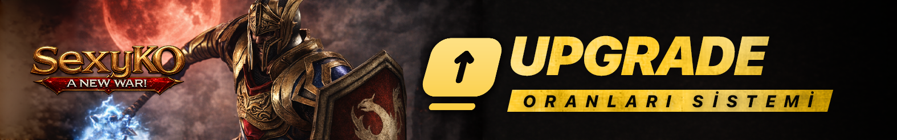
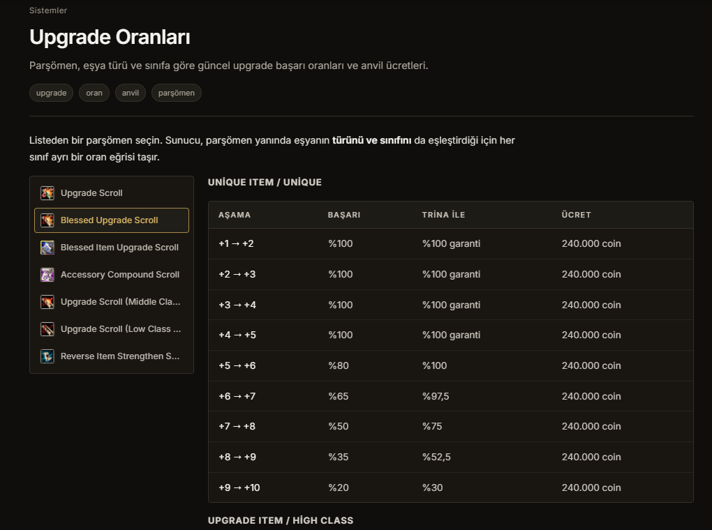
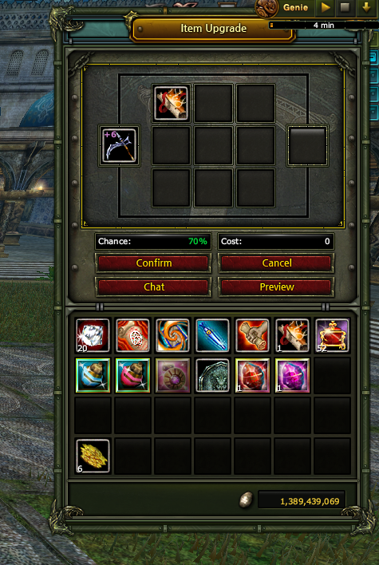

# 🔨 SEXYKO UPGRADE ORANLARI SİSTEMİ

- Forum: https://forum.sexyko.com/d/26
- Etiket: Oyun Rehberi, SexyKO Oyun Rehberi
- Açılış: 2026-08-31 · yazar Tenger · mesaj 1 · görüntülenme ?
- Arşiv: 8 Eki 2026 (Flarum API) · resim 3/3

## Mesaj 1 — Tenger — 2026-08-31 21:25 (düzenleme 2026-09-03)

SexyKO'da item upgrade işlemleri artık çok daha şeffaf ve anlaşılır hale getirildi.

Oyuncular, upgrade oranlarını sadece işlem anında değil, aynı zamanda **Rehber sistemi** üzerinden de görüntüleyebilir.

Böylece bir itemi anvilde basmadan önce başarı oranını kontrol edebilir, işlem sırasında ise gerekli coin miktarıyla birlikte oranları doğrudan görebilirsiniz.

---

## 📘 REHBER ÜZERİNDEN UPGRADE ORANLARINI GÖRME

Aşağıdaki görselde görüldüğü gibi upgrade oranlarına **oyun içindeki Rehber sistemi** üzerinden ulaşabilirsiniz.

Bu bölüm sayesinde oyuncular:

- upgrade oranlarını önceden inceleyebilir,

- hangi itemin hangi aşamada ne kadar şansa sahip olduğunu görebilir,

- basım öncesi daha bilinçli karar verebilir.

Özellikle upgrade yapmadan önce oranları kontrol etmek isteyen oyuncular için bu sistem büyük kolaylık sağlar.

Kısacası, bilgi almak için ekstra bir yere gitmenize gerek kalmadan oranlara doğrudan oyun içinden ulaşabilirsiniz.

---

## ⚒️ ANVIL ÜZERİNDE CANLI ORAN GÖRÜNTÜLEME

Upgrade oranları yalnızca rehberde değil, **Anvil ekranında da doğrudan görüntülenebilir.**

Aşağıdaki görselde görüldüğü gibi iteminizi Anvil'e koyduğunuz anda:

- **başarı oranını**

- **gerekli coin miktarını**

- ve işlemle ilgili detayları

anlık olarak görebilirsiniz.

Bu sayede upgrade basmadan önce tüm önemli bilgileri tek ekranda görmüş olursunuz.

---

## 💰 ANVIL'DE NELERİ GÖREBİLİRSİNİZ?

Anvil ekranında itemi yerleştirdiğinizde oyuncuya önemli bilgiler gösterilir.

Bunlar arasında:

- **Upgrade başarı oranı**

- **İşlem için gereken coin miktarı**

- **Basım öncesi genel kontrol bilgileri**

yer alır.

Bu sistem, oyuncunun neye basacağını ve ne kadar maliyetle işlem yapacağını önceden görmesini sağlar.

---

## ✅ BU SİSTEMİN AVANTAJI NEDİR?

Upgrade sistemi ne kadar açık olursa oyuncu için o kadar güven verir.

Bu sistem sayesinde:

- oranları önceden görebilirsiniz,

- anvilde sürpriz yaşamazsınız,

- coin maliyetini işlem öncesi öğrenirsiniz,

- upgrade sürecini daha kontrollü yönetebilirsiniz.

Özellikle seri upgrade yapan oyuncular için bu sistem büyük kolaylık sağlar.

---

## 🎯 KISACASI

SexyKO'da upgrade oranlarını öğrenmek için iki farklı kolay yöntem bulunmaktadır:

**1️⃣ Rehber üzerinden**

Upgrade oranlarını önceden inceleyebilirsiniz.

**2️⃣ Anvil üzerinden**

Itemi koyduğunuz anda başarı oranı ve coin miktarını anlık olarak görebilirsiniz.

Böylece upgrade süreci daha şeffaf, daha kontrollü ve daha kullanıcı dostu hale gelir.

---

# 🔥 SEXYKO UPGRADE SİSTEMİ

**Oranını gör • Coinini öğren • Sonra bas!**

Upgrade artık daha açık, daha anlaşılır ve daha güvenli.
