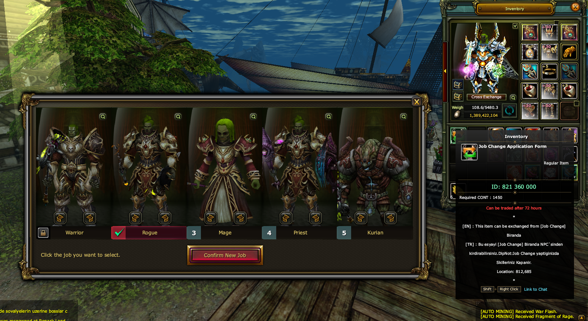

# 🔄 SEXYKO JOB CHANGER KULLANIMI

- Forum: https://forum.sexyko.com/d/28
- Etiket: Oyun Rehberi, SexyKO Oyun Rehberi
- Açılış: 2026-08-31 · yazar Tenger · mesaj 1 · görüntülenme ?
- Arşiv: 8 Eki 2026 (Flarum API) · resim 2/2

## Mesaj 1 — Tenger — 2026-08-31 21:54 (düzenleme 2026-09-03)

# 🔄 SEXYKO JOB CHANGER KULLANIMI

SexyKO'da **Job Changer** kullanımı oldukça kolaydır.

Job Changer itemine **sağ tıklayarak** menüyü açabilir ve bulunduğunuz yerden doğrudan job değiştirme işlemini gerçekleştirebilirsiniz.

---

## ⚙️ JOB CHANGER NASIL KULLANILIR?

**1️⃣** Job Changer itemine sağ tıklayın.

**2️⃣** Job değiştirme ekranını açın.

**3️⃣** Geçmek istediğiniz jobu seçin.

**4️⃣** Gerekli şartı sağladıktan sonra işlemi tamamlayın.

NPC aramanıza veya farklı bir bölgeye gitmenize gerek yoktur.

**Job Changer bulunduğunuz yerden kullanılabilir.**

---

## ⚠️ GEREKLİ ŞART

Job değiştirme işlemi yapmadan önce:

### 🎒 KARAKTERİN ÜZERİNDEKİ TÜM ITEMLERİ ÇIKARTIN

Karakterinizin üzerinde takılı olan:

- silahlar,

- armor parçaları,

- takılar,

- yardımcı ekipmanlar

tamamen çıkartılmış olmalıdır.

**Karakterin üzerinde herhangi bir item takılıyken Job Changer işlemi gerçekleştirilemez.**

---

## ✅ İŞLEM ÖNCESİ KONTROL

Job Changer kullanmadan önce tek yapmanız gereken:

**✔️ Karakterinizin üzerindeki tüm itemleri çıkarmak.**

Ardından Job Changer itemine sağ tıklayarak job değişiminizi kolayca tamamlayabilirsiniz.

---

# 🔥 SEXYKO JOB CHANGER

**Itemlerini çıkar • Sağ tıkla • Jobunu seç • Değişimini tamamla!**

### ⚠️ UNUTMAYIN

**Job değiştirebilmek için karakterinizin üzerinde takılı hiçbir item bulunmamalıdır.**
