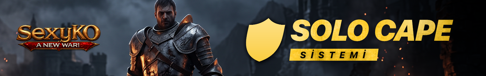
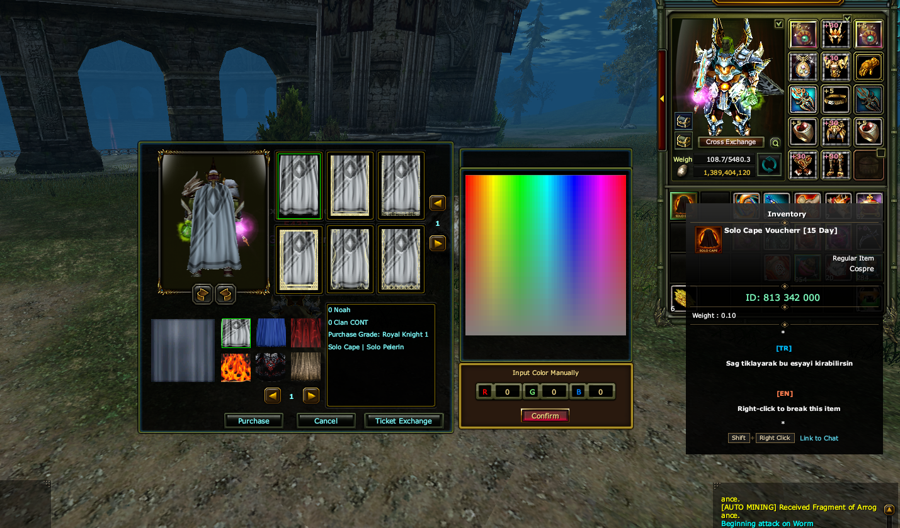
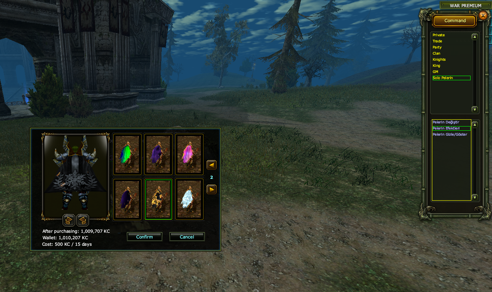

# 🦸 SEXYKO SOLO CAPE SİSTEMİ

- Forum: https://forum.sexyko.com/d/29
- Etiket: Oyun Rehberi, SexyKO Oyun Rehberi
- Açılış: 2026-08-31 · yazar Tenger · mesaj 1 · görüntülenme ?
- Arşiv: 8 Eki 2026 (Flarum API) · resim 3/3

## Mesaj 1 — Tenger — 2026-08-31 22:49 (düzenleme 2026-09-03)

# 🦸 SEXYKO SOLO CAPE SİSTEMİ

SexyKO'da bulunan **Solo Cape Sistemi** sayesinde artık oyuncular bir clana girmeden de pelerin kullanabilir ve pelerin bonuslarından yararlanabilir.

Bu sistem, solo oynayan oyuncular için büyük kolaylık sağlar.

Üstelik toplam **21 farklı pelerin** arasından dilediğinizi seçebilir, rengini belirleyebilir ve kendi tarzınıza göre kullanabilirsiniz.

---

## 🎟️ SOLO CAPE NASIL AKTİF EDİLİR?

Solo Cape sistemini kullanabilmek için öncelikle ilgili ürünü **Power Up Store (PUS)** üzerinden satın almanız gerekir.

Satın aldıktan sonra iteme **sağ tıklayarak** aşağıdaki görselde bulunan pencereyi açabilirsiniz.

Açılan pencerede:

**Ticket Exchange** seçeneğine tıklayarak Solo Cape sistemini aktif hale getirebilirsiniz.

Yani kullanım sırası oldukça basittir:

**1️⃣ PUS'tan satın al**

**2️⃣ Iteme sağ tıkla**

**3️⃣ Açılan pencereden Ticket Exchange'e tıkla**

**4️⃣ Solo Cape sistemini aktif et**

---

## 🎨 21 FARKLI PELERİN SEÇENEĞİ

Solo Cape sistemi içerisinde oyunculara toplam:

**21 adet farklı pelerin seçeneği**

sunulmaktadır.

Oyuncular bu pelerinler arasından istediklerini seçebilir, ayrıca kendi zevklerine göre **renk vererek** kullanabilir.

Bu sayede hem görsel çeşitlilik artar hem de oyuncular karakterlerini daha özgün hale getirebilir.

---

## 👕 H MENÜSÜNDEN DESEN ALMA

Solo Cape sisteminin bir diğer güzel özelliği ise pelerin desenlerini sonradan özelleştirebilmenizdir.

Aşağıdaki görselde görüldüğü gibi **H** tuşuna bastığınızda açılan bölümde **Solo Pelerin** sekmesine girerek pelerinize **KC karşılığında desen** alabilirsiniz.

Bu sayede sadece pelerin kullanmakla kalmaz, görünümünü de daha özel hale getirebilirsiniz.

---

## 🌬️ GERÇEKÇİ PELERİN EFEKTLERİ

Solo Cape sistemi yalnızca görünüm açısından değil, görsel kalite açısından da özenle hazırlanmıştır.

Pelerinler:

- oyunun rüzgarına göre **dalgalanır,**

- hareket sırasında daha doğal görünür,

- efektleri daha **gerçekçi** şekilde yansıtılır.

Bu sayede karakter üzerindeki cape görünümü daha canlı, daha estetik ve daha modern bir hava kazandırır.

---

## ✅ KISACASI

SexyKO Solo Cape sistemi sayesinde:

- clana girmeden pelerin kullanabilirsiniz,

- pelerin bonuslarından yararlanabilirsiniz,

- toplam 21 farklı pelerin arasından seçim yapabilirsiniz,

- pelerinlerin rengini değiştirebilirsiniz,

- H menüsündeki Solo Pelerin bölümünden KC karşılığında desen alabilirsiniz,

- daha gerçekçi ve dalgalanan pelerin efektleriyle karakterinizi daha şık hale getirebilirsiniz.

---

# 🔥 SEXYKO SOLO CAPE SİSTEMİ

**Clansız pelerin kullan • Tarzını oluştur • Bonuslardan yararlan!**

**21 farklı cape, özel renk seçenekleri ve gerçekçi görünüm şimdi SexyKO'da!**
