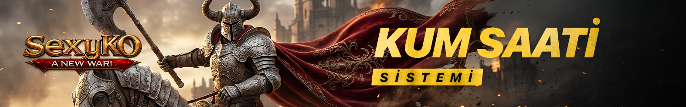
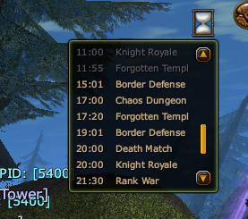
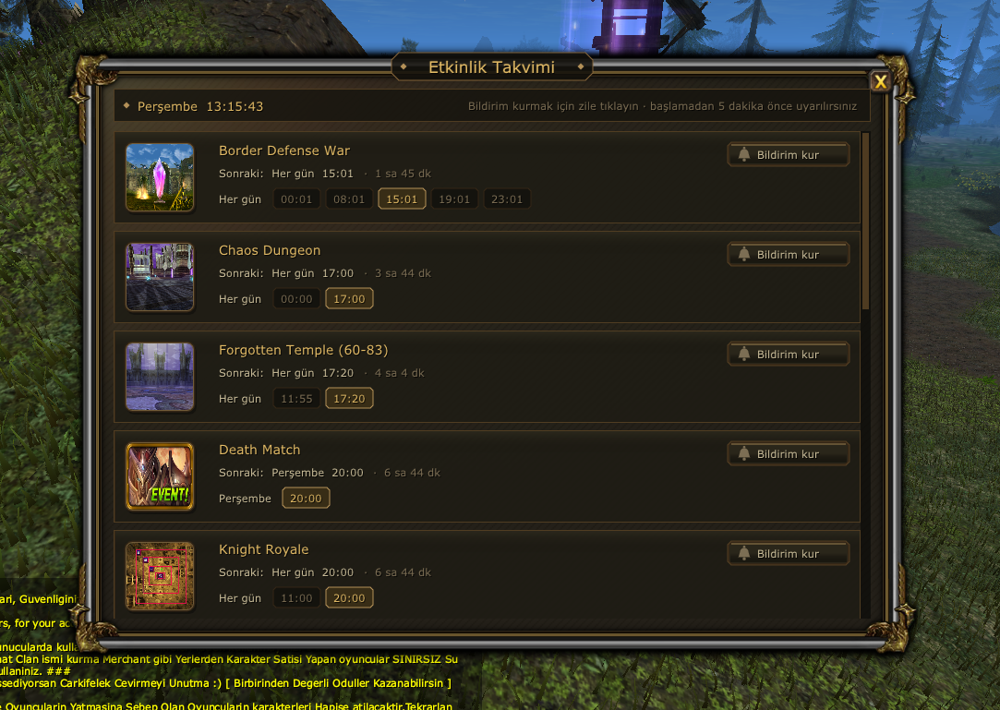

# ⏳ SEXYKO KUM SAATİ SİSTEMİ

- Forum: https://forum.sexyko.com/d/38
- Etiket: Oyun Rehberi, SexyKO Oyun Rehberi
- Açılış: 2026-09-10 · yazar Tenger · mesaj 1 · görüntülenme ?
- Arşiv: 8 Eki 2026 (Flarum API) · resim 3/3

## Mesaj 1 — Tenger — 2026-09-10 10:18 (düzenleme 2026-09-16)

# ⏳ SEXYKO KUM SAATİ SİSTEMİ

SexyKO'da bulunan **Kum Saati Sistemi**, oyun içerisindeki etkinlikleri anlık olarak takip edebilmeniz ve hiçbir etkinliği kaçırmamanız için hazırlanmıştır.

Bu sistem sayesinde hangi etkinliğin ne zaman başlayacağını kolayca görebilir, detaylarını inceleyebilir ve isterseniz etkinlik başlamadan önce bildirim kurabilirsiniz.

---

## 📍 KUM SAATİ NEREDE?

Kum saati simgesi oyun ekranının **sağ üst bölümünde** yer almaktadır.

Bu simge üzerinden oyun içerisindeki etkinlikleri hızlıca kontrol edebilir ve detaylı etkinlik penceresine ulaşabilirsiniz.

---

## 🖱️ ÜZERİNE GELDİĞİNİZDE ANLIK EVENT BİLGİSİ

Kum saatinin üzerine geldiğinizde, o anda görüntüleyebileceğiniz **bilgi penceresi (Info)** açılır.

Bu pencere sayesinde:

- aktif veya yaklaşan eventleri görebilir,

- etkinlik saatlerini hızlı şekilde kontrol edebilir,

- oyun içerisinden çıkmadan anlık bilgi alabilirsiniz.

Bu özellik özellikle “şimdi hangi event var?” sorusunun cevabını hızlıca almak için oldukça kullanışlıdır.

---

## ⏰ KUM SAATİNE TIKLADIĞINIZDA DETAYLI EVENT PENCERESİ AÇILIR

Kum saatine tıkladığınızda, etkinlikleri daha detaylı şekilde görüntüleyebileceğiniz tam pencere açılır.

Bu pencere üzerinden:

- hangi eventin ne zaman başlayacağını,

- etkinliklerin saatlerini,

- yaklaşan etkinlikleri,

- etkinlik sıralamasını

detaylı şekilde görebilirsiniz.

Böylece tek tek event saatlerini ezberlemenize gerek kalmadan tüm bilgilere tek ekrandan ulaşabilirsiniz.

---

## 🔔 5 DAKİKA KALA BİLDİRİM KURABİLİRSİNİZ

Kum Saati sisteminin en kullanışlı özelliklerinden biri de **bildirim / alarm sistemi**dir.

İstediğiniz event için:

**Etkinliğe 5 dakika kala bildirim kurabilirsiniz.**

Bu sayede:

- event saatini kaçırmazsınız,

- hazırlığınızı önceden yapabilirsiniz,

- pot, skill, party ve diğer hazırlıklarınızı zamanında tamamlayabilirsiniz.

Özellikle yoğun oynayan ve aynı anda birden fazla işle uğraşan oyuncular için bu özellik büyük kolaylık sağlar.

---

## 🎯 KUM SAATİ SİSTEMİ NE İŞE YARAR?

Bu sistemin temel amacı, oyuncuların oyun içi etkinlikleri çok daha rahat takip edebilmesini sağlamaktır.

Sistem sayesinde:

- event saatlerini öğrenebilirsiniz,

- yaklaşan etkinlikleri anlık görebilirsiniz,

- detaylı event penceresine ulaşabilirsiniz,

- bildirim kurarak etkinlikleri kaçırmazsınız.

Kısacası bu sistem, **oyun içi etkinlik takibini çok daha düzenli ve pratik hale getirir.**

---

## ✅ KISACASI

**Sağ üstteki kum saatinin üzerine gel → Anlık event bilgisini gör**

**Kum saatine tıkla → Detaylı etkinlik penceresini aç**

**İstediğin eventi seç → 5 dakika kala bildirim kur**

---

# 🔥 SEXYKO KUM SAATİ SİSTEMİ

**Eventlerini takip et • Saatleri öğren • Bildirim kur • Hiçbir etkinliği kaçırma!**

SexyKO Kum Saati Sistemi ile tüm etkinlikler artık elinizin altında.
