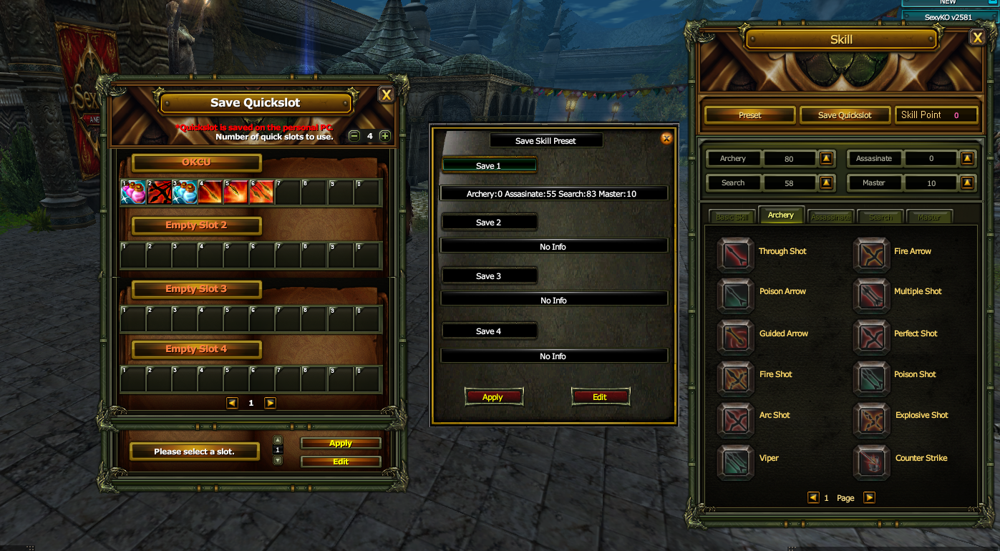
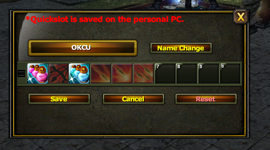
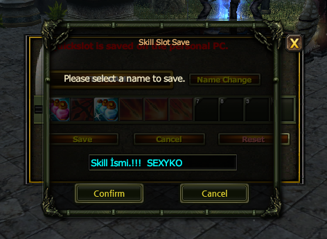

# ⚔️ SEXYKO SKILL PRESET & QUICK SLOT SİSTEMİ

- Forum: https://forum.sexyko.com/d/42
- Etiket: Oyun Rehberi, SexyKO Oyun Rehberi
- Açılış: 2026-09-13 · yazar Tenger · mesaj 1 · görüntülenme ?
- Arşiv: 8 Eki 2026 (Flarum API) · resim 3/3

## Mesaj 1 — Tenger — 2026-09-13 23:58

# ⚔️ SEXYKO SKILL PRESET & QUICK SLOT SİSTEMİ

SexyKO'da bulunan **Skill Preset** ve **Quick Slot** sistemi sayesinde karakterinizin skill puanlarını ve skill bar dizilimlerini ayrı ayrı kaydedebilir, ihtiyaç duyduğunuz anda hızlıca değiştirebilirsiniz.

Bu sistem özellikle PK, farm, party veya farklı oyun stilleri arasında sık geçiş yapan oyuncular için büyük kolaylık sağlar.

---

## 📍 SKILL PENCERESİNE NASIL ULAŞILIR?

Oyunda **K** tuşuna bastığınızda Skill penceresi açılır.

Bu pencere üzerinden:

- Skill puanlarınızı yönetebilir,

- Preset oluşturabilir,

- Skill dağılımınızı kaydedebilir,

- Quick Slot düzenlerinizi oluşturabilir,

- Kayıtlı düzenler arasında hızlıca geçiş yapabilirsiniz.

---

# 🧠 01 — SKILL PRESET SİSTEMİ

**Preset Sistemi**, verdiğiniz skill puanlarını kayıt altına almanızı sağlar.

Örneğin karakteriniz için farklı kullanım düzenleri oluşturabilirsiniz:

- PK düzeni

- Farm düzeni

- Party düzeni

- Solo kullanım düzeni

Skill puanlarınızı bir kez hazırladıktan sonra Preset olarak kaydedebilirsiniz.

Daha sonra **Edit** seçeneği üzerinden mevcut Preset'i düzenleyebilir ve tekrar kaydedebilirsiniz.

Böylece her seferinde skill puanlarını baştan dağıtmak yerine kayıtlı düzeninizi kullanabilirsiniz.

---

## ✏️ EDIT İLE PRESET DÜZENLEME

Mevcut Preset üzerinde değişiklik yapmak istediğinizde:

**Edit** seçeneğine tıklayın.

Ardından istediğiniz skill dağılımını oluşturup:

**Save**

butonuna basarak yeni düzeninizi kaydedin.

Bu sayede Skill Preset'lerinizi oyun stilinize göre istediğiniz zaman güncelleyebilirsiniz.

---

# ⚡ 02 — SAVE QUICKSLOT SİSTEMİ

Skill puanlarınızı kaydetmenin yanında, skill bar diziliminizi de ayrıca kaydedebilirsiniz.

SexyKO'da toplam:

# 🔥 4 FARKLI QUICK SLOT KAYDI

oluşturabilirsiniz.

Bu sayede farklı kullanım amaçları için 4 ayrı skill bar hazırlayabilirsiniz.

Örneğin:

**Quick Slot 1** → PK

**Quick Slot 2** → Farm

**Quick Slot 3** → Party

**Quick Slot 4** → Event

gibi farklı düzenler oluşturabilirsiniz.

---

## 🛠️ QUICK SLOT NASIL KAYDEDİLİR?

Quick Slot bölümünün alt tarafında bulunan **Edit** seçeneğine tıklayın.

Aşağıdaki ekran üzerinden skill barınızı istediğiniz şekilde düzenleyebilirsiniz.

Skilllerinizi istediğiniz sıraya yerleştirdikten sonra:

**Save**

butonuna basarak mevcut skill bar düzeninizi kaydedebilirsiniz.

Bundan sonra kayıtlı Quick Slot'u ihtiyacınız olduğunda hızlıca kullanabilirsiniz.

---

# 🏷️ 03 — SKILL TABLONIZA İSİM VERİN

Kaydettiğiniz Skill Preset veya Quick Slot düzenlerini birbirinden daha kolay ayırabilmek için özel isim verebilirsiniz.

Örneğin:

- **PK Build**

- **Farm Build**

- **JR Build**

- **BDW Build**

- **Party Priest**

- **Solo Build**

gibi isimler kullanabilirsiniz.

Bu sayede kayıtlı düzenleriniz arasında geçiş yaparken hangisinin hangi amaçla hazırlandığını kolayca anlayabilirsiniz.

---

# 🔄 04 — ANLIK SKILL DÜZENİ DEĞİŞTİRME

Preset sisteminin en önemli avantajlarından biri, kayıtlı skill dağılımlarınızı hızlı şekilde değiştirebilmenizdir.

Yani:

**Skill puanlarını tekrar tekrar elle dağıtmak yerine**

önceden hazırladığınız Preset'i seçerek farklı oyun stiline geçebilirsiniz.

Bu özellik özellikle:

- PK'dan farm'a geçen,

- Farm'dan event'e giren,

- Solo oyundan party oyununa geçen

oyuncular için ciddi zaman kazandırır.

---

# 🎯 PRESET VE QUICKSLOT ARASINDAKİ FARK

## 🧠 Skill Preset

Karakterinizin **skill puanı dağılımını** kaydeder.

## ⚡ Quick Slot

Skill barınızda bulunan **skill dizilimini ve kullanım sırasını** kaydeder.

Yani iki sistem birbirinden farklıdır ama birlikte kullanıldığında çok daha güçlü hale gelir.

---

# ✅ ÖRNEK KULLANIM

Diyelim ki Rogue karakter oynuyorsunuz.

### ⚔️ PK için:

- PK Skill Preset'inizi seçin.

- PK Quick Slot düzeninizi aktif edin.

### 🐺 Farm için:

- Farm Skill Preset'inizi seçin.

- Farm Quick Slot düzeninizi kullanın.

Böylece skill puanlarını ve barları her defasında baştan hazırlamak zorunda kalmazsınız.

---

# 📌 KISACASI

SexyKO Skill sistemi sayesinde:

- **K tuşundan Skill ekranına ulaşabilirsiniz.**

- Skill puanlarınızı **Preset olarak kaydedebilirsiniz.**

- Preset'lerinizi **Edit** ile düzenleyebilirsiniz.

- Skill barlarınızı **Save Quickslot** ile kaydedebilirsiniz.

- Toplam **4 farklı Quick Slot** oluşturabilirsiniz.

- Kayıtlarınıza özel isim verebilirsiniz.

- Farklı oyun stilleri arasında hızlıca geçiş yapabilirsiniz.

---

# 🔥 SEXYKO SKILL PRESET & QUICK SLOT

**Skill puanını kaydet • Skill barını oluştur • İsmini ver • Tekrar tekrar uğraşma**

### ⚔️ PK, FARM, PARTY VE EVENT DÜZENLERİNİ TEK SİSTEMDE YÖNET!
