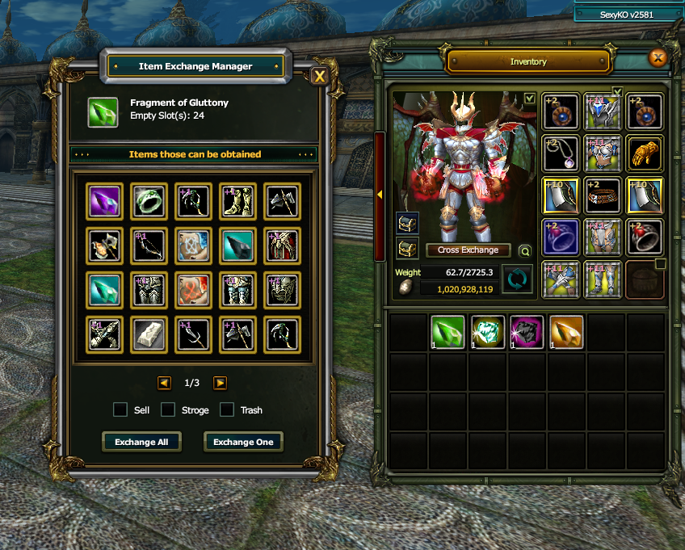

# ♻️ SEXYKO CHAOTIC GENERATOR & TOPLU KIRDIRMA SİSTEMİ

- Forum: https://forum.sexyko.com/d/43
- Etiket: Oyun Rehberi, SexyKO Oyun Rehberi
- Açılış: 2026-09-14 · yazar Tenger · mesaj 1 · görüntülenme ?
- Arşiv: 8 Eki 2026 (Flarum API) · resim 1/1

## Mesaj 1 — Tenger — 2026-09-14 13:50 (düzenleme 2026-09-14)

# ♻️ SEXYKO CHAOTIC GENERATOR & TOPLU KIRDIRMA SİSTEMİ

SexyKO'da **Gem, Fragment ve Chaotic Generator üzerinden kırdırılabilen itemleri** artık daha hızlı ve daha kontrollü şekilde işleyebilirsiniz.

Iteme **sağ tıkladığınızda** açılan pencere üzerinden:

- tek tek kırdırma,

- toplu kırdırma,

- istemediğiniz itemleri filtreleme,

- direkt satış,

- bankaya gönderme,

- çöpe atma

işlemlerini tek ekran üzerinden yapabilirsiniz.

---

## ⚙️ CHAOTIC GENERATOR NASIL KULLANILIR?

Gem, Fragment veya benzeri kırdırılabilir iteme **sağ tıkladığınızda** özel işlem penceresi açılır.

Buradan kırdırma işlemini iki farklı şekilde yapabilirsiniz.

---

# 🔹 EXCHANGE ONE

**Exchange One** seçeneği ile itemleri tek tek kırdırabilirsiniz.

Yani:

**1 adet item → 1 adet kırdırma işlemi**

mantığıyla çalışır.

Tek tek kontrol ederek işlem yapmak isteyen oyuncular için uygundur.

---

# 🔸 EXCHANGE ALL

**Exchange All** seçeneği ile inventory'nizde bulunan itemleri toplu şekilde kırdırabilirsiniz.

Sistem, inventory'nizde bulunan **boş slot miktarı kadar** kırdırma işlemi yapar.

Bu özellik özellikle:

- çok sayıda Gem,

- Fragment,

- kutu,

- benzeri kırdırılabilir item

biriktiren oyuncular için büyük zaman kazandırır.

Tek tek tıklamak yerine toplu işlem yapabilirsiniz.

---

# 🚫 İSTEMEDİĞİNİZ ITEMLERİ SEÇİN

Kırdırma sonucunda gelen itemlerden birini istemiyorsanız:

**İteme sağ tıklayarak karartabilirsiniz.**

Karartılan item, alt tarafta seçmiş olduğunuz işleme göre otomatik olarak değerlendirilir.

Yani sistem o itemi normal şekilde inventory'nize almak yerine sizin belirlediğiniz işlemi uygular.

---

# 💰 SELL — DİREKT SATIŞ

**Sell** seçeneği aktifken kararttığınız itemler doğrudan satılır.

Bu işlem:

**Sundries'e satış yapıyormuşsunuz gibi**

çalışır.

### 💵 SATIŞ BİRİM FİYATI

Itemin üzerine geldiğinizde:

**Satış Birim Fiyatı**

görüntülenir.

Böylece itemi Sell olarak işaretlemeden önce ne kadar coin kazanacağınızı görebilirsiniz.

Kırdırma sırasında gereksiz gördüğünüz itemleri direkt coin'e çevirmek için kullanabilirsiniz.

---

# 🏦 STORAGE — BANKAYA GÖNDER

**Storage** seçeneği aktifken karartılmış item:

**doğrudan bankanıza gönderilir.**

Bu sistem özellikle saklamak istediğiniz ama inventory'nizde yer kaplamasını istemediğiniz itemlerde oldukça kullanışlıdır.

Yani:

**Kırdır → Item çıksın → Otomatik bankaya gitsin**

mantığıyla çalışır.

---

# 🗑️ TRASH — ÇÖPE AT

**Trash** seçeneği aktifken kararttığınız itemler direkt olarak silinir.

### ⚠️ DİKKAT

Trash işlemi sonucunda:

**Coin kazanılmaz.**

Item tamamen çöpe atılır ve karşılığında herhangi bir ödeme alınmaz.

Bu yüzden Trash seçeneğini kullanırken itemlerinizi dikkatli seçmeniz önerilir.

---

# 🎯 KARARTILAN ITEM NASIL İŞLENİR?

Sistem oldukça basit çalışır.

Önce istemediğiniz iteme:

**Sağ tıklayın → Item kararsın**

Ardından alt bölümden hangi işlemin uygulanacağını seçin:

### 💰 SELL

Itemi sat ve coin kazan.

### 🏦 STORAGE

Itemi bankaya gönder.

### 🗑️ TRASH

Itemi tamamen sil.

Kararttığınız itemler kırdırma sonucunda geldiğinde seçtiğiniz işlem otomatik olarak uygulanır.

---

# ⚡ SİSTEMİN AVANTAJLARI

SexyKO Chaotic Generator sistemi sayesinde:

- itemleri tek tek kırdırabilirsiniz,

- toplu şekilde kırdırabilirsiniz,

- gereksiz itemleri otomatik satabilirsiniz,

- değerli itemleri bankaya gönderebilirsiniz,

- istemediğiniz itemleri çöpe atabilirsiniz,

- inventory yönetimini çok daha kolay hale getirebilirsiniz.

---

# 📌 KISACASI

**Exchange One** → 1 adet kırdır

**Exchange All** → Boş inventory slotu kadar toplu kırdır

İstemediğin iteme:

**Sağ tıkla → Karart**

Ardından:

**💰 Sell** → Sat

**🏦 Storage** → Bankaya gönder

**🗑️ Trash** → Çöpe at

---

# 🔥 SEXYKO CHAOTIC GENERATOR SİSTEMİ

**Kırdır • Filtrele • Sat • Bankaya gönder • Gereksizi çöpe at**

### ♻️ DAHA HIZLI, DAHA TEMİZ, DAHA KONTROLLÜ ITEM YÖNETİMİ!
