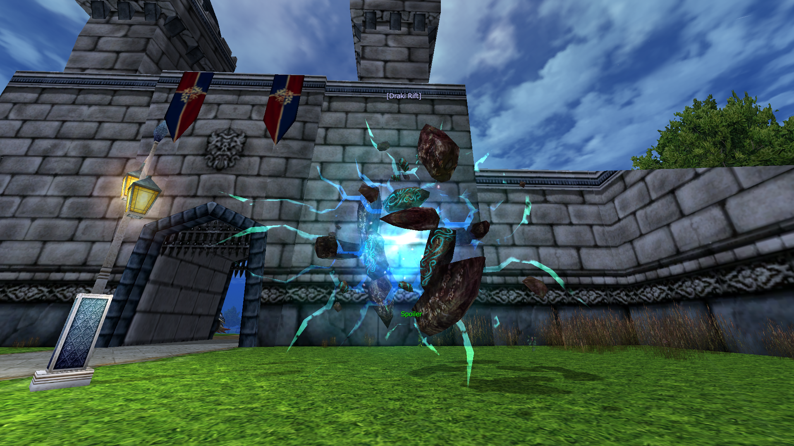
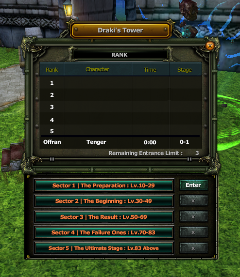
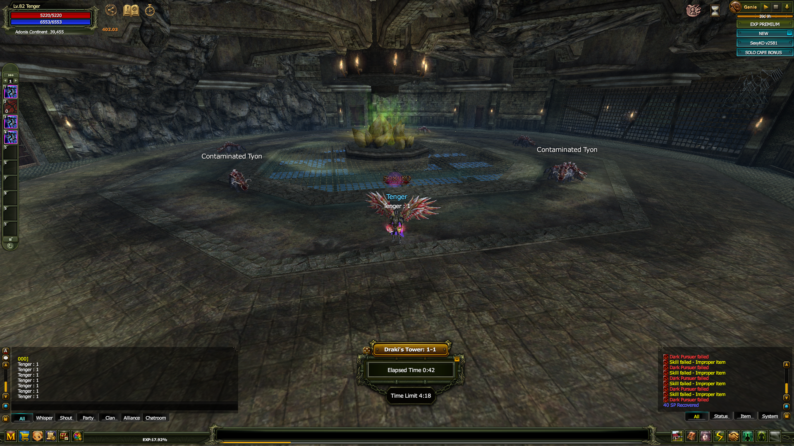

# 🐉 SEXYKO DRAKI'S TOWER SİSTEMİ

- Forum: https://forum.sexyko.com/d/45
- Etiket: Oyun Rehberi, SexyKO Oyun Rehberi
- Açılış: 2026-09-17 · yazar Tenger · mesaj 1 · görüntülenme ?
- Arşiv: 8 Eki 2026 (Flarum API) · resim 3/3

## Mesaj 1 — Tenger — 2026-09-17 00:17 (düzenleme 2026-09-27)

# 🐉 SEXYKO DRAKI'S TOWER SİSTEMİ

SexyKO'da bulunan **Draki's Tower**, zamana karşı yarış mantığıyla çalışan özel bir PvE zindan sistemidir.

Amaç; içeride bulunan yaratıkları ve bossları mümkün olan en hızlı şekilde temizlemek, bölümleri tamamlamak ve en iyi süreyi yaparak sıralamada yer almaktır.

Draki sistemi yalnızca bir zindan değil; aynı zamanda görev, ödül ve sıralama sistemiyle bağlantılı önemli bir içeriktir.

---

## 📍 DRAKI'YE NEREDEN GİRİLİR?

Draki giriş noktası aşağıdaki görselde yer almaktadır.

Draki'ye giriş için:

- El Morad oyuncuları **El Morad Castle**

- Karus oyuncuları **Luferson Castle**

içerisindeki **Draki Rift** girişini kullanır.

### Günlük giriş hakkı:

**3 kez**

### Minimum katılım seviyesi:

**80 Level**

---

## 🎁 GIFT PENCERESİ

Draki giriş alanında bulunan **Gift** seçeneğine tıkladığınızda aşağıdaki pencere açılır.

Bu bölüm üzerinden Draki sistemiyle bağlantılı ödül ve özel işlem alanlarını görüntüleyebilirsiniz.

---

## 🚪 DRAKI İÇERİSİNDE İLK ODA

Draki'ye giriş yaptıktan sonra karşılaşacağınız ilk oda görünümü aşağıdaki gibidir.

Buradan itibaren zindan içerisinde kat kat ilerlemeye başlarsınız.

Temel mantık:

- odaları temizlemek,

- yaratıkları kesmek,

- bossları öldürmek,

- bir sonraki kata geçmek,

- mümkün olan en iyi süreyi yapmak

üzerine kuruludur.

---

# ⚔️ DRAKI NASIL ÇALIŞIR?

Draki's Tower toplam **5 farklı bölümden** oluşur.

Her bölüm içerisinde birden fazla kat ve farklı yaratıklar bulunur.

Bölümlerin ilerleyen kısımlarında daha güçlü yaratıklar ve bosslar karşınıza çıkar.

Amaç yalnızca zindanı tamamlamak değil, bunu mümkün olduğunca hızlı yapmaktır.

---

## 🧩 DRAKI BÖLÜMLERİ

### 1. Bölüm — The Preparation

Başlangıç seviyesi yaratıklar ve ilk bosslar bulunur.

### 2. Bölüm — The Beginning

Bir önceki bölüme göre daha güçlü yaratıklar yer alır.

### 3. Bölüm — The Result

Orta seviye bosslar ve daha güçlü yaratıklarla devam eder.

### 4. Bölüm — The Failure Ones

Zindan bu bölümden itibaren daha zor hale gelir.

### 5. Bölüm — The Ultimate Stage

Draki'nin en zorlu bölümüdür.

Bu bölümün sonunda:

**Draki El Rasaga**

ile karşılaşırsınız.

---

# 🏆 DRAKI SIRALAMA SİSTEMİ

Draki'nin en önemli özelliklerinden biri sıralama sistemidir.

Sıralamada:

- zindanı ne kadar hızlı tamamladığınız,

- kaç bölüm bitirdiğiniz,

- yaptığınız toplam süre

önemlidir.

Daha iyi süre yapan oyuncular aylık sıralamada daha üst sıralarda yer alabilir.

---

# 📌 DRAKI'DE DİKKAT EDİLMESİ GEREKENLER

Draki'ye girmeden önce:

- potlarınızı kontrol edin,

- item durability durumunuzu kontrol edin,

- skill diziliminizi hazırlayın,

- mümkün olduğunca hızlı ilerlemeye odaklanın,

- gereksiz beklemelerden kaçının.

Özellikle sıralama hedefliyorsanız her saniye önemlidir.

---

# ✅ KISACASI

SexyKO Draki sistemi:

- **Günde 3 kez girilebilir**

- **Minimum 80 Level gerektirir**

- **5 farklı bölümden oluşur**

- Kat kat ilerlenen PvE zindanıdır

- Boss ve görev sistemi bulunur

- Tamir ve takviye NPC'leri vardır

- Süreye bağlı sıralama sistemi bulunur

- Aylık sıralama ödülleri vardır

---

# 🔥 SEXYKO DRAKI'S TOWER

**Draki'ye gir • Katları temizle • Bossları kes • Süreni geliştir • Sıralamaya gir**

### 🐉 HIZ, GÜÇ VE TAKTİK — DRAKI'DE HEPSİ ÖNEMLİ!
