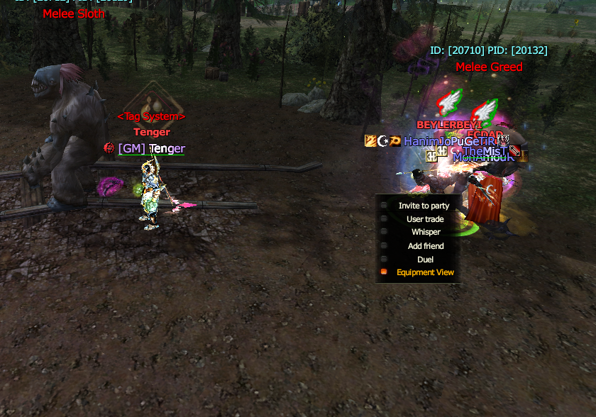
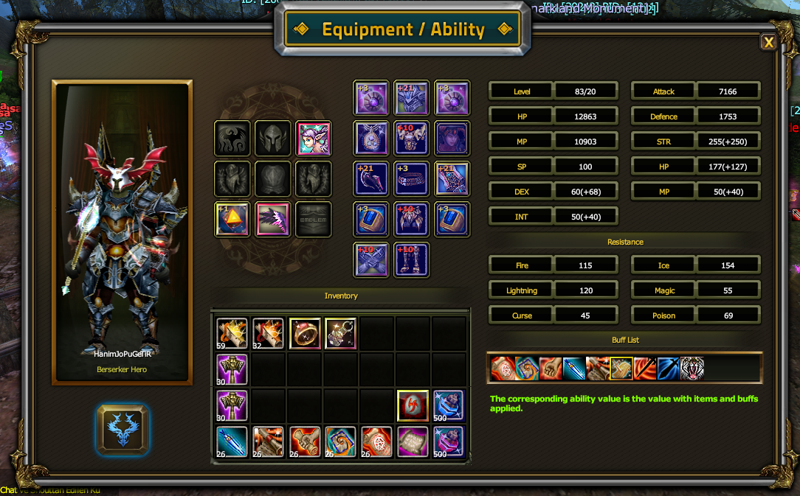

# 👁️ SEXYKO EQUIPMENT VIEW SİSTEMİ

- Forum: https://forum.sexyko.com/d/46
- Etiket: Oyun Rehberi, SexyKO Oyun Rehberi
- Açılış: 2026-09-19 · yazar Tenger · mesaj 1 · görüntülenme ?
- Arşiv: 8 Eki 2026 (Flarum API) · resim 2/2

## Mesaj 1 — Tenger — 2026-09-19 23:20

# 👁️ SEXYKO EQUIPMENT VIEW SİSTEMİ

SexyKO'da bulunan **Equipment View Sistemi** sayesinde bir oyuncunun karakterine ait detaylı bilgileri tek pencere üzerinden inceleyebilirsiniz.

Sistem yalnızca karakterin üzerindeki itemleri göstermekle kalmaz; aynı zamanda **stat değerlerini, resistance bilgilerini, aktif buffları ve inventory görünümünü** de detaylı şekilde gösterir.

Bu sayede başka bir oyuncunun karakter yapısını çok daha kapsamlı şekilde inceleyebilirsiniz.

---

## 🖱️ EQUIPMENT VIEW NASIL AÇILIR?

İncelemek istediğiniz karaktere **sağ tıklayın.**

Açılan menüde:

**Equipment View**

seçeneğine tıklayın.

Bu işlemin ardından seçtiğiniz oyuncunun detaylı **Equipment / Ability** penceresi açılır.

---

# 🧩 EQUIPMENT / ABILITY PENCERESİ

Bu ekran üzerinden karakterin birçok bilgisini aynı anda görebilirsiniz.

---

## 👤 KARAKTER GÖRÜNÜMÜ

Sol tarafta oyuncunun karakter modeli görüntülenir.

Buradan:

- karakter görünümünü,

- kullanılan kostüm / görünüm öğelerini,

- karakterin genel ekipman görünümünü

inceleyebilirsiniz.

---

## 🛡️ TAKILI EQUIPMENTLER

Orta bölümde karakterin üzerinde bulunan ekipmanlar gösterilir.

Bu alanda:

- silah

- zırh parçaları

- takılar

- kemer

- yüzükler

- küpeler

- kolye

- yardımcı ekipmanlar

- kostüm / özel slotlar

gibi kullanılan itemleri görebilirsiniz.

Itemlerin **upgrade seviyeleri** de ikonların üzerinde görüntülenir.

Örneğin:

**+3 / +10 / +21**

gibi mevcut item seviyelerini doğrudan görebilirsiniz.

---

# 🎒 INVENTORY GÖRÜNÜMÜ

Equipment View ekranının alt bölümünde karakterin **Inventory** alanı da görüntülenir.

Bu bölümde oyuncunun çantasında bulunan itemleri ve adetlerini görebilirsiniz.

Böylece sistem yalnızca takılı itemleri değil, karakter üzerindeki genel item durumunu da tek pencerede gösterir.

---

# 📊 KARAKTER STATLARI

Sağ tarafta karakterin temel stat değerleri ayrıntılı şekilde gösterilir.

Görüntülenebilen bilgiler arasında:

### ⭐ LEVEL

Karakterin mevcut seviyesini gösterir.

### ❤️ HP

Karakterin toplam can değerini gösterir.

### 💙 MP

Toplam mana değerini gösterir.

### ⚡ SP

Karakterin SP değerini gösterir.

### 💪 STR

Strength değerini gösterir.

### 🎯 DEX

Dexterity değerini gösterir.

### 🧠 INT

Intelligence değerini gösterir.

---

# ⚔️ SALDIRI VE SAVUNMA DEĞERLERİ

Aynı panel üzerinden karakterin savaş gücüyle ilgili önemli değerler de görüntülenebilir.

### ⚔️ ATTACK

Karakterin toplam saldırı değerini gösterir.

### 🛡️ DEFENCE

Karakterin toplam savunma değerini gösterir.

Statlarda parantez içerisinde bulunan değerler ise item ve bufflardan gelen ek katkıları gösterir.

Örneğin:

**STR 255 (+250)**

gibi bir ifade, karakterin ana STR değeriyle beraber ekipman ve bufflardan gelen ek değeri görmenizi sağlar.

---

# 🔥 RESISTANCE DEĞERLERİ

Equipment View ekranında karakterin direnç değerleri de ayrı ayrı görüntülenir.

Bunlar:

- 🔥 **Fire Resistance**

- ❄️ **Ice Resistance**

- ⚡ **Lightning Resistance**

- ✨ **Magic Resistance**

- ☠️ **Curse Resistance**

- 🧪 **Poison Resistance**

şeklindedir.

Bu bilgiler özellikle PK ve PvP tarafında karakterin hangi elementlere karşı daha dayanıklı olduğunu anlamanızı sağlar.

---

# ✨ BUFF LIST

Sağ alt bölümde **Buff List** alanı bulunmaktadır.

Burada karakterin üzerinde aktif olan buff ve destek efektlerini görebilirsiniz.

Yani oyuncunun:

- hangi buffları kullandığını,

- aktif destek efektlerini,

- savaş sırasında üzerinde bulunan güçlendirmeleri

tek bakışta inceleyebilirsiniz.

---

# 🔍 NEDEN ÖNEMLİ?

Equipment View sistemi sayesinde bir oyuncunun karakterini sadece dış görünüşten değerlendirmek zorunda kalmazsınız.

Tek pencerede:

- ekipmanlarını,

- item upgrade seviyelerini,

- inventory durumunu,

- statlarını,

- attack / defence değerlerini,

- resistance değerlerini,

- aktif bufflarını

görebilirsiniz.

Bu da sistemi klasik Equipment View yapılarından çok daha kapsamlı hale getirir.

---

# ✅ KISACASI

**Karaktere sağ tıkla → Equipment View seçeneğine bas → Tüm detayları incele**

SexyKO Equipment View sistemi ile:

- ekipmanları gör

- statları kontrol et

- resistance değerlerini incele

- buffları gör

- inventory’yi görüntüle

---

# 🔥 SEXYKO EQUIPMENT VIEW

**Tek tıkla karakteri incele, tüm detayları tek ekranda gör!**
